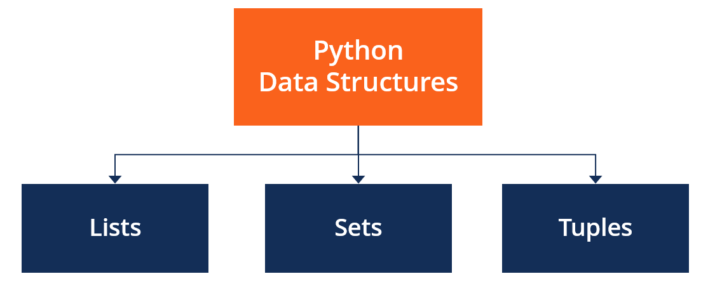

{width="500"}


# Built-in Data Structures

## Singular Values

```{python}
# Assign an integer value to variable a
a=1
# Print the type of variable a
type(a)
```

```{python}
# Assign a float value to variable a
a=1.3
# Print the type of variable a
type(a)
```

```{python}
# Assign a string value to variable a
a='hell'
# Print the type of variable a
type(a)
```


```{python}
# Assign a boolean value to variable a
a= True
# Print the type of variable a
type(a)
```

## List

Lists are ordered, mutable (changeable) sequences that can store items of different data types. They are defined by enclosing elements in square brackets `[]`.

```{python}
# Define a list named a
a=[1,2,3]

# Print the list
a
```

```{python}
# Print the type of variable a
type(a) 
```


```{python}
# Define a list of fruits
fruits = ['orange', 'apple', 'pear', 'banana', 'kiwi', 'apple', 'banana','apple']
```

### Find Length of the List with `len()`

```{python}
# Print the length of the fruits list
len(fruits)
```

### First 2 Elements of the List

```{python}
# Get the first 2 elements of the fruits list
fruits[:2]
```

### Last 2 Elements of the List

```{python}
# Get the last 2 elements of the fruits list
fruits[-2:]
```


### Find how many times in the list with `count()`

```{python}
# Count the number of times 'apple' appears in the fruits list
fruits.count('apple')
```

### Find location on the list with `index()`

show the first 'apple' index. Python lists start at 0

```{python}
# Find the index of the first occurrence of 'apple' in the fruits list
fruits.index('apple')
```

all 'apple' in the list

```{python}
# Use a list comprehension to find all indices where the value is 'apple'
[index for index, value in enumerate(fruits) if value == 'apple']
```

### Reverse the list

```{python}
# Reverse the order of elements in the fruits list in-place
fruits.reverse()
# Print the modified fruits list
fruits
```

### Sort the list

```{python}
# Sort the elements of the fruits list in-place alphabetically
fruits.sort()
# Print the modified fruits list
fruits
```

### Add element to the list

```{python}
# Add 'grape' to the end of the fruits list
fruits.append('grape')
# Print the modified fruits list
fruits
```

### Drop last element

```{python}
# Remove and return the last element from the fruits list
fruits.pop()

# Print the modified fruits list
fruits
```

### List Comprehensions

using loop:

```{python}
# Initialize an empty list to store squares
squares = []
# Loop from 0 to 9
for x in range(10):
  # Append the square of x to the squares list
  squares.append(x**2)
  
# Print the squares list
squares
```

using List Comprehensions

```{python}
# Create a list of squares using a list comprehension
squares = [x**2 for x in range(10)]
# Print the squares list
squares
```


### List to Tuples

```{python}
# Convert the squares list to a tuple
tuple(squares)
```


### List to Set 

```{python}
# Convert the squares list to a set
set(squares)
```

### List to Dictionary 

#### One list to dictionary
```{python}

# Define a list
list=['a', 1, 'b', 2, 'c', 3]

# Define a function to convert a list to a dictionary
def convert(lst):
   res_dict = {}
   for i in range(0, len(lst), 2):
       res_dict[lst[i]] = lst[i + 1]
   return res_dict
 
# Call the convert function with the list
convert(list)

```

#### Two lists to dictionary

```{python}

# Import the itertools module (though not used in this specific example)
import itertools

# Define a tuple of keys
keys = ('name', 'age', 'food')

# Define a tuple of values
values = ('Monty', 42, 'spam')

# Create a dictionary by zipping the keys and values
dict(zip(keys, values))

```

## Tuples

Tuples are ordered, immutable (unchangeable) sequences. They are defined by enclosing elements in parentheses `()`.

```{python}
# Define a tuple named fruits
fruits = ('orange', 'apple', 'pear', 'banana', 'kiwi', 'apple', 'banana','apple')

# Print the tuple
fruits
```

```{python}
# Print the type of the fruits tuple
type(fruits)
```

tuple cannot be modified.

## Sets

A set is an unordered collection with no duplicate elements. Sets are useful for mathematical set operations like union, intersection, difference, and symmetric difference. They are defined by enclosing elements in curly braces `{}`.

```{python}
# Define a set named basket with duplicate elements
basket = {'apple', 'orange', 'apple', 'pear', 'orange', 'banana'}

# Print the set (duplicates are automatically removed)
basket
```

```{python}
# Print the type of the basket set
type(basket)
```

## Dictionaries

Dictionaries are unordered collections of key-value pairs. Each key must be unique, and it maps to a value. Dictionaries are defined by enclosing key-value pairs in curly braces `{}`.

```{python}
# Define a dictionary named tel
tel = {'jack': 4098, 'sape': 4139}

# Print the dictionary
tel
```

```{python}
# Print the type of the tel dictionary
type(tel)
```

```{python}
# Access the value associated with the key 'jack' in the tel dictionary
tel['jack']
```

# NumPy Data Structures (Matrix in Python)

NumPy is the fundamental package for scientific computing in Python. It is a Python library that provides a multidimensional array object

Python doesn't have a built-in type for matrices. However, we can treat a list of a list as a matrix

```{python}
# Define a list of lists representing a matrix
A = [[1, 4, 5, 12], 
    [-5, 8, 9, 0],
    [-6, 7, 11, 19]]
    
# Print the matrix
A
```

## NumPy Array

```{python}
# Import the numpy library
import numpy as np

# Create a 2x3 NumPy array
A2 = np.array([[1, 2, 3], [3, 4, 5]])
# Print the array
print(A2)
```


```{python}
# Print the type of the A2 array
type(A2)
```

## Shape
```{python}
# Print the shape of the A2 array (rows, columns)
A2.shape
```


## Row Number
```{python}
# Print the number of rows in the A2 array
len(A2)
```

## Total Elements

```{python}
# Print the total number of elements in the A2 array
A2.size
```

## Dimension 
```{python}
# Print the number of dimensions of the A2 array
A2.ndim
```


## Count NumPy Array Elements

```{python}
# Import the collections and numpy modules
import collections, numpy
# Create a NumPy array
a = numpy.array([0, 3, 0, 4])
# Count the occurrences of each element in the array
collections.Counter(a)
```

## Convert List into NumPy Array

```{python}
# Define a list of lists
A = [
  [1, 4, 5, 12], 
  [-5, 8, 9, 0],
  [-6, 7, 11, 19],
  [1, 4, 5, 12], 
  [-5, 8, 9, 0],
  [-6, 7, 11, 19],
  [1, 4, 5, 12], 
  [-5, 8, 9, 0],
  [-6, 7, 11, 19]
  ]
    
# Convert the list of lists to a NumPy array
A3 = np.array(A)

# Print the NumPy array
print(A3)
```


## Selection


### First 5 Rows

```{python}
# Select the first 5 rows of the array
A[:5]
```

### Last 5 Rows

```{python}
# Select all rows except the last 5
A[:-5]
```

### First Row

```{python}
# Select the first row of the array
A[0]
```

### First Column

```{python}
# Select the first column of the A2 array
A2[:,0]
```

### First Row and First Column Element

```{python}
# Select the element at the first row and first column of the A2 array
A2[0,0]
```

```{python}
# Print the data type of the elements in the A2 array
A2.dtype
```

### Second Row and Third Column

```{python}
# Select the element at the second row (index 1) and third column (index 2) of the A2 array
A2[1,2]
```

## Filter 

### filter all
```{python}
# Print the A3 array
print(A3)
```

```{python}
# Create a boolean array where True indicates elements greater than 4
A3>4
```

```{python}
# Select elements from A3 that are greater than 4
A3[A3>4]
```

### Filter Row 

```{python}
# Print the A3 array
A3
```


filter second column > 5
```{python}
# Create a boolean array where True indicates rows where the second column (index 1) has a value greater than 5
filter_val=(A3>5)[:,2]
```

which only keeps 2,3 rows.
```{python}
# Select rows from A3 based on the filter_val boolean array, and all columns
A3[filter_val,0:]
```


## Create NumPy Array

### Create Identity Matrix
```{python}
# Create a 3x3 identity matrix
np.eye(3)
```

### Create Zeros Array
```{python}
# Create a 2x3 array filled with zeros
np.zeros((2,3))
```

### Create Ones Array
```{python}
# Create a 2x3 array filled with ones
np.ones((2,3))
```


## Compare Arrays

```{python}
# Creating Array
a = np.array([1,2,3,4]) 
b = np.array([3,2,5,6])
```

```{python} 
# Compare if elements of array a are greater than elements of array b
np.greater(a, b)
```


```{python}
# Compare if elements of array a are greater than or equal to elements of array b
a >= b
```


```{python} 
# Compare if elements of array a are less than elements of array b
np.less(a, b)
```


```{python} 
# Compare if elements of array a are equal to elements of array b
np.equal(a, b)
```


## Reshape Array

```{python}
# Create a 1D array with values from 0 to 8 and reshape it into a 3x3 2D array
a=np.arange(9).reshape(3, 3)

# Print the reshaped array
a
```


## Array Calculations

```{python}

# Perform element-wise multiplication of array a by itself
b=a*a
# Print the result
b

```

```{python}
# Perform element-wise addition of array a to itself
b=a+a
# Print the result
b
```

## NumPy Array to DataFrame
```{python}
# Import the pandas library
import pandas as pd
# Create a DataFrame from the NumPy array b, with specified column names
df = pd.DataFrame(b, columns=['Column_A', 'Column_B', 'Column_C'])

# Print the DataFrame
df
```


# Reference

https://docs.python.org/3/tutorial/datastructures.html#

https://numpy.org/doc/stable/user/basics.rec.html