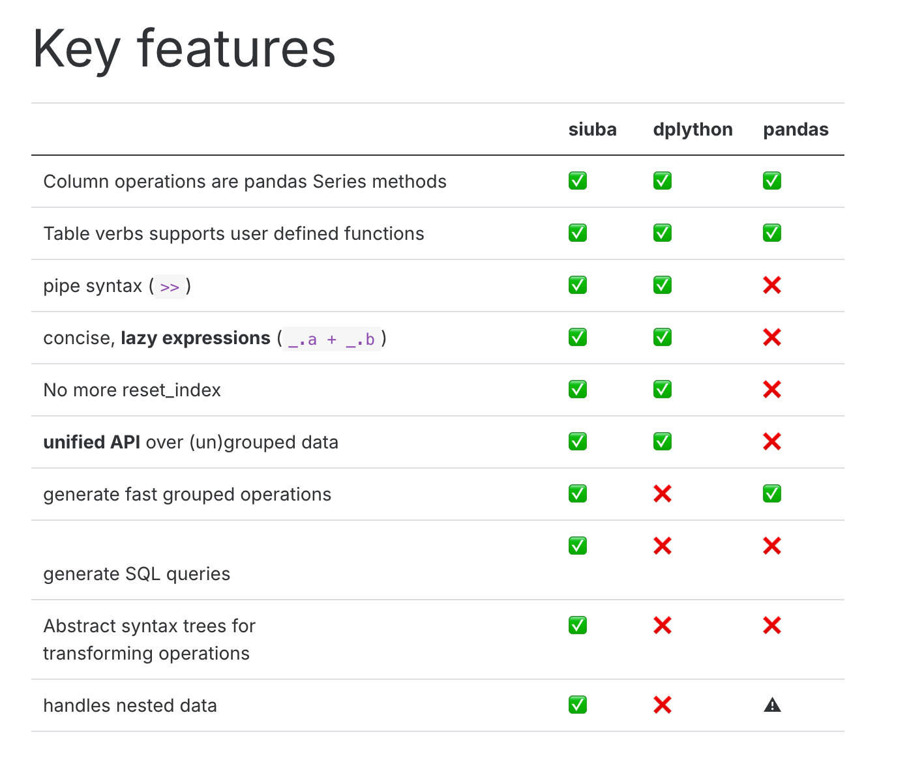

{width="434"}
siuba (小巴) is a port of dplyr and other R libraries with seamless support for pandas and SQL

## Comparison with different python dataframe package


{width="656"}
Using python 3.11 

```{r}
Sys.setenv(RETICULATE_PYTHON = "/Library/Frameworks/Python.framework/Versions/3.11/bin/python3.11")
library(reticulate)
use_python("/Library/Frameworks/Python.framework/Versions/3.11/bin/python3.11")
```


## load package
```{python}
# Import pandas for data manipulation
import pandas as pd
# Import numpy for numerical operations
import numpy as np
# Import matplotlib.pylab for plotting
import matplotlib.pylab as plt
# Import seaborn for statistical data visualization
import seaborn as sns


# Import specific functions and objects from siuba
from siuba.siu import call
from siuba import _, mutate, filter, group_by, summarize,show_query
from siuba import *

# Import sample datasets from siuba
from siuba.data import mtcars,penguins
```


```{python}
# Select 'cyl', 'mpg', and 'hp' columns from mtcars and then take the first 5 rows
small_mtcars = mtcars >> select(_.cyl, _.mpg, _.hp)>> head(5)
```

## select column

### get column names

```{python}
# Get a list of column names from the small_mtcars DataFrame
list(small_mtcars)
```


### select columns by name
```{python}
# Select 'cyl' and 'mpg' columns from the small_mtcars DataFrame
small_mtcars >> select(_.cyl, _.mpg)
```
### select columns by name match with 'p'

```{python}
# Select columns whose names contain the letter 'p'
small_mtcars >> select(_.contains("p"))
```


### select columns by index

#### select first and 3rd columns
```{python}
# Select the columns at index 0 (first) and 2 (third)
small_mtcars >> select(0,2)
```
#### select first to 3rd columns
```{python}
# Select columns from index 0 up to (but not including) index 3
small_mtcars >> select(_[0:3])
```

## drop column

```{python}
# Drop the 'cyl' column from the small_mtcars DataFrame
small_mtcars >> select(~_.cyl)
```

## Renaming column

```{python}
# Rename the 'mpg' column to 'new_name_mpg'
small_mtcars >> rename(new_name_mpg = _.mpg)
```

## Create column

### Mutate
```{python}
# Create new columns based on existing ones
mtcars.head()>> mutate(gear2 = _.gear+1
                      ,gear3=if_else(_.gear > 3, "long", "short")
                       ,qsec2=case_when({
                                          _.qsec <= 17: "short",
                                          _.qsec <= 18: "Medium",
                                          True: "long"
                                                     })
                       )

```
### Transmute,create column and only keep this column

```{python}
# Create a new column 'gear2' and keep only this column
mtcars.head()>> transmute(gear2 = _.gear+1)
```


## Filter rows

```{python}
# Filter rows where 'gear' is equal to 4
mtcars>> filter(_.gear ==4)
```

### Filters with AND conditions

```{python}
# Filter rows where 'cyl' is greater than 4 AND 'gear' is equal to 5
mtcars >> filter((_.cyl >4) & (_.gear == 5))
```


### Filters with OR conditions


```{python}
# Filter rows where 'cyl' is equal to 6 OR 'gear' is equal to 5
mtcars >> filter((_.cyl == 6) | (_.gear == 5))
```
### filter row with index

#### first 3

```{python}
# Select the first 3 rows of the small_mtcars DataFrame
small_mtcars>>head(3)
```
#### last 3

```{python}
# not in siuba, in pandas
# Select the last 3 rows of the small_mtcars DataFrame using pandas
small_mtcars.tail(3)
```

#### 5th rows
```{python}
# not in siuba, in pandas
# Select the row at index 4 (which is the 5th row) using pandas
mtcars.iloc[[4]]
```

#### 1 and 5th rows
```{python}
# not in siuba, in pandas
# Select rows at index 0 (1st row) and 4 (5th row) using pandas
mtcars.iloc[[0,4]]
```

#### 1 to 5th rows
```{python}
# not in siuba, in pandas
# Select rows from index 0 up to (but not including) index 4 using pandas
mtcars.iloc[0:4]
```
#### get ramdon 5 rows

```{python}
# Select 5 random rows from the mtcars DataFrame using pandas, with a fixed random_state for reproducibility
mtcars.sample(5, random_state=42)
```

## Append


### append by row

```{python}
# not available in siuba yet
#from siuba import bind_rows
```

```{python}
# using pandas

# get 1 to 4 rows
data1=mtcars.iloc[0:4]

# get 9 rows
data2=mtcars.iloc[10:11]

# Concatenate data1 and data2 DataFrames by row, ignoring the original index
data3=pd.concat([data1, data2], ignore_index = True,axis=0)

# Display the concatenated DataFrame
data3
```
### append by column

```{python}
# not available in siuba yet
#from siuba import bind_columns
```

```{python}
# using pandas
# Select the 'mpg' column from small_mtcars
data1=small_mtcars>>select(_.mpg)

# Select the 'cyl' column from small_mtcars
data2=small_mtcars>>select(_.cyl)

# Concatenate data1 and data2 DataFrames by column
data3=pd.concat([data1, data2],axis=1)

# Display the concatenated DataFrame
data3
```


### Dropping NA values

Missing values (NaN) can be handled by either removing rows/columns with missing data or by filling them with appropriate values.

#### Drop rows with any NA values

```python
# Create a sample DataFrame with missing values
df_missing = pd.DataFrame({
    'A': [1, 2, np.nan, 4],
    'B': [5, np.nan, np.nan, 8],
    'C': [9, 10, 11, 12]
})
print("Original DataFrame:")
print(df_missing)

# Drop rows that contain any NaN values
df_dropped_all = df_missing.dropna()
print("\nDataFrame after dropping rows with any NA:")
print(df_dropped_all)
```

#### Drop rows with NAs in specific columns

```python
# Drop rows that have NaN values in column 'A'
df_dropped_col_a = df_missing.dropna(subset=['A'])
print("\nDataFrame after dropping rows with NA in column 'A':")
print(df_dropped_col_a)
```

### Filling NA values

Missing values can be filled with a specific value, the mean, median, or previous/next valid observation.

#### Fill with a specific value

```python
# Fill all NaN values with 0
df_filled_zero = df_missing.fillna(0)
print("\nDataFrame after filling NA with 0:")
print(df_filled_zero)
```

#### Fill with mean of the column

```python
# Fill NaN values in column 'B' with the mean of column 'B'
df_filled_mean = df_missing.copy()
df_filled_mean['B'] = df_filled_mean['B'].fillna(df_filled_mean['B'].mean())
print("\nDataFrame after filling NA in column 'B' with its mean:")
print(df_filled_mean)
```

#### Forward fill (ffill)

```python
# Forward fill NaN values (propagate last valid observation forward to next valid observation)
df_ffill = df_missing.fillna(method='ffill')
print("\nDataFrame after forward fill:")
print(df_ffill)
```

#### Backward fill (bfill)

```python
# Backward fill NaN values (propagate next valid observation backward to next valid observation)
df_bfill = df_missing.fillna(method='bfill')
print("\nDataFrame after backward fill:")
print(df_bfill)
```


## group by


### average,min,max,sum
```{python}
# Group the mtcars DataFrame by the 'cyl' column and summarize various statistics
tbl_query = (mtcars
  >> group_by(_.cyl)
  >> summarize(avg_hp = _.hp.mean()
              ,min_hp=_.hp.min()
              ,max_hp=_.hp.max()
              ,totol_disp=_.disp.sum()
  )
  )

# Display the resulting aggregated DataFrame
tbl_query
```

### count record and count distinct record

```{python}
# Group the mtcars DataFrame by the 'cyl' column and count the number of rows in each group
mtcars >> group_by(_.cyl)  >> summarize(n = _.shape[0])
```


```{python}
# Group the mtcars DataFrame by the 'cyl' column and count the number of unique 'hp' values for each group
mtcars >> group_by(_.cyl)  >> summarize(n = _.hp.nunique())
```


## order rows

```{python}
# Sort the small_mtcars DataFrame by the 'hp' column in ascending order
small_mtcars >> arrange(_.hp)
```

### Sort in descending order

```{python}
# Sort the small_mtcars DataFrame by the 'hp' column in descending order
small_mtcars >> arrange(-_.hp)
```

### Arrange by multiple variables

```{python}
# Sort the small_mtcars DataFrame by 'cyl' in ascending order and 'mpg' in descending order
small_mtcars >> arrange(_.cyl, -_.mpg)
```


## join

```{python}

# Create a pandas DataFrame named lhs
lhs = pd.DataFrame({'id': [1,2,3], 'val': ['lhs.1', 'lhs.2', 'lhs.3']})
# Create a pandas DataFrame named rhs
rhs = pd.DataFrame({'id': [1,2,4], 'val': ['rhs.1', 'rhs.2', 'rhs.3']})
```


```{python}
# Display the lhs DataFrame
lhs
```

```{python}
# Display the rhs DataFrame
rhs
```


### inner_join

```{python}
# Perform an inner join of lhs and rhs DataFrames on the 'id' column
result=lhs >> inner_join(_, rhs, on="id")
# Display the result
result
```


### full join

```{python}
# Perform a full outer join of rhs and lhs DataFrames on the 'id' column
result=rhs >> full_join(_, lhs, on="id")
# Display the result
result
```


### left join 

```{python}
# Perform a left join of lhs and rhs DataFrames on the 'id' column
result=lhs >> left_join(_, rhs, on="id")
# Display the result
result
```
### anti join

keep data in left which not in right
```{python}
# Perform an anti-join: keep rows from lhs that do not have a match in rhs based on 'id'
result=lhs >> anti_join(_, rhs, on="id")
# Display the result
result
```


keep data in right which not in left
```{python}
# Perform an anti-join: keep rows from rhs that do not have a match in lhs based on 'id'
result=rhs >> anti_join(_, lhs, on="id")
# Display the result
result
```


## Reshape tables


```{python}
# Create a pandas DataFrame named costs
costs = pd.DataFrame({
    'id': [1,2],
    'price_x': [.1, .2],
    'price_y': [.4, .5],
    'price_z': [.7, .8]
})

# Display the DataFrame
costs
```


### Gather data long(wide to long)

Below 3 method will give same result

```{python}
# selecting each variable manually
# Gather (melt) the costs DataFrame from wide to long format, specifying columns to gather
costs >> gather('measure', 'value', _.price_x, _.price_y, _.price_z)
```

other way:
```{python}
# selecting variables using a slice
# Gather (melt) the costs DataFrame from wide to long format, specifying a slice of columns to gather
costs >> gather('measure', 'value', _["price_x":"price_z"])
```
other way:
```{python}
# selecting by excluding id
# Gather (melt) the costs DataFrame from wide to long format, excluding the 'id' column
costs >> gather('measure', 'value', -_.id)
```

### Spread data wide(long to wide)


```{python}
# Gather the costs DataFrame into a long format and store it in costs_long
costs_long= costs>> gather('measure', 'value', -_.id)
# Display the costs_long DataFrame
costs_long
```

```{python}
# Spread the costs_long DataFrame from long to wide format
costs_long>> spread('measure', 'value')
```


## string

siuba provides convenient methods for string manipulation, often mirroring pandas string methods, allowing for efficient operations on text data within DataFrames.

```{python}

# Create a pandas DataFrame named df
df = pd.DataFrame({'text': ['abc', 'DDD','1243c','aeEe'], 'num': [3, 4,7,8]})

# Display the DataFrame
df
```

### upper case

```{python}
# Add a new column 'text_new' with the uppercase version of the 'text' column
df>> mutate(text_new=_.text.str.upper())
```
### lower case

```{python}
# Add a new column 'text_new' with the lowercase version of the 'text' column
df>> mutate(text_new=_.text.str.lower())
```
### match

```{python}
# Add multiple new columns based on string matching conditions
df>> mutate(text_new1=if_else(_.text== "abc",'T','F')
            ,text_new2=if_else(_.text.str.startswith("a"),'T','F')
            ,text_new3=if_else(_.text.str.endswith("c"),'T','F')
            ,text_new4=if_else(_.text.str.contains("4"),'T','F')

)

```

###  concatenation

```{python}
# Add a new column 'text_new1' by concatenating the 'text' column with itself, separated by ' is '
df>> mutate(text_new1=_.text+' is '+_.text
)

```


### replace

Use .str.replace(..., regex=True) with regular expressions to replace patterns in strings.

For example, the code below uses "p.", where . is called a wildcard–which matches any character.

```{python}
# Add a new column 'text_new1' by replacing patterns in the 'text' column using a regular expression
df>> mutate(text_new1=_.text.str.replace("a.", "XX", regex=True)
)

```
### extract

Use str.extract() with a regular expression to pull out a matching piece of text.

For example the regular expression “^(.*) ” contains the following pieces:

-  a matches the literal letter “a”

- .* has a . which matches anything, and * which modifies it to apply 0 or more times.

```{python}
# Add new columns by extracting substrings from the 'text' column using regular expressions
df>> mutate(text_new1=_.text.str.extract("a(.*)")
            ,text_new2=_.text.str.extract("(.*)c")
)

```


## date

siuba leverages pandas' datetime capabilities, allowing for flexible parsing, manipulation, and formatting of date and time data.

```{python}
# Create a pandas DataFrame with 'dates' and 'raw' columns
df_dates = pd.DataFrame({
    "dates": pd.to_datetime(["2021-01-02", "2021-02-03"]),
    "raw": ["2023-04-05 06:07:08", "2024-05-06 07:08:09"],
})
# Display the DataFrame
df_dates
```

### Extracting Date Components

You can extract various components like year, month, day, hour, minute, second from datetime objects.

```python
# Extract year, month, and day from the 'dates' column
df_dates >> mutate(
    year=_.dates.dt.year,
    month=_.dates.dt.month,
    day=_.dates.dt.day
)
```

### Formatting Dates

Dates can be formatted into different string representations using `strftime()`.

```python
# Format the 'raw' column as YYYY-MM-DD HH:MM:SS
df_dates >> mutate(
    formatted_raw=call(pd.to_datetime, _.raw).dt.strftime("%Y-%m-%d %H:%M:%S")
)
```

```{python}
# Import datetime module
from datetime import datetime

# Add new columns for month name, formatted raw date, and year from raw date
df_date=df_dates>>mutate(month=_.dates.dt.month_name()
                  ,date_format_raw = call(pd.to_datetime, _.raw)
                  ,date_format_raw_year=_.date_format_raw.dt.year

)

# Display the DataFrame
df_date
```
```{python}
df_date.info()
```


## using siuba with database

### set up a sqlite database, with an mtcars table.
```{python}
# Import create_engine from sqlalchemy for database connection
from sqlalchemy import create_engine
# Import LazyTbl for lazy SQL operations
from siuba.sql import LazyTbl
# Import necessary siuba functions
from siuba import _, group_by, summarize, show_query, collect 
# Import mtcars dataset
from siuba.data import mtcars

# Create an in-memory SQLite database engine
engine = create_engine("sqlite:///:memory:")
# Copy the mtcars DataFrame to a SQL table named 'mtcars', replacing it if it already exists
mtcars.to_sql("mtcars", engine, if_exists = "replace")
```

### create table
```{python}
# Create a lazy SQL DataFrame representing the 'mtcars' table in the database
tbl_mtcars = LazyTbl(engine, "mtcars")
# Display the LazyTbl object
tbl_mtcars
```

### create query
```{python}
# connect with siuba

# Create a query that groups by 'mpg' and summarizes the average 'hp'
tbl_query = (tbl_mtcars
  >> group_by(_.mpg)
  >> summarize(avg_hp = _.hp.mean())
  )

# Display the query object
tbl_query
```

### show query
```{python}
 # Show the generated SQL query
 tbl_query >> show_query()
```
### Collect to DataFrame

because lazy expressions,the collect function is actually running the sql.
```{python}
# Collect the results of the query into a pandas DataFrame
data=tbl_query >> collect()
# Print the resulting DataFrame
print(data)
```


## reference:

https://siuba.org/
