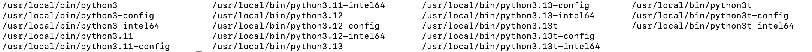
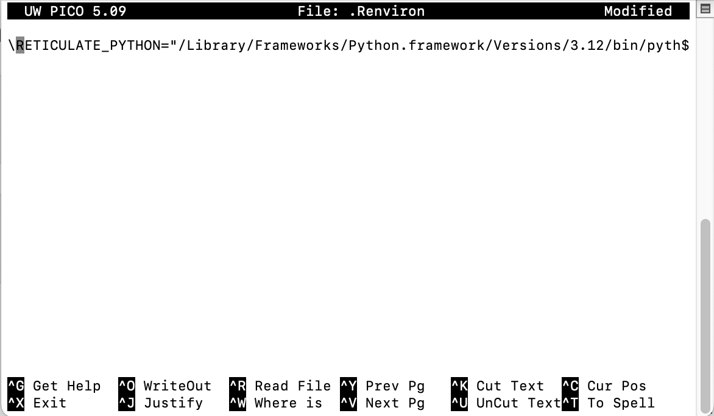

{width="300"}

# Python Installation Guide


## Managing Python Versions in Quarto

```{r}
library(reticulate)
py_require(c('pandas','pipdeptree'))
use_python("/Library/Frameworks/Python.framework/Versions/3.13/bin/python3.13")
```


## Check Python Version

```{python}
# Import the sys module to access system-specific parameters and functions
import sys
# Print the Python version to the console
print(sys.version)
```

## Check Python location 

```{python}
print(sys.executable)
```

## Delete Old Python Version on Mac

### Delete Framework

Go → Computer → Macintosh HD → Library → Frameworks → Python.framework → Versions

Delete the old version Python folder:


### Delete Python Files

List all Python files:

```{bash}
ls /usr/local/bin/python*
```



Delete the old version:

```{bash}
#| eval: false
brew uninstall python@3.11
```

## Set Python Version in RStudio

List all files in home path:

```{python filename="Terminal"}
#| eval: false
ls -a
```

Find .Renviron and edit to new version:

```{python filename="Terminal"}
#| eval: false
nano .Renviron
```

{width="510"}

# Install Jupyter

```{python filename="Terminal"}
#| eval: false
python3 -m pip install jupyter
```

# Basic Data Types

Python has several built-in data types to store different kinds of values. Understanding these fundamental types is crucial for writing effective Python code.

## Numbers

Python supports various numerical types, including integers (whole numbers) and floating-point numbers (numbers with decimal points).

### Integers
Integers are whole numbers, positive or negative, without a decimal point.
```python
# Example of an integer
my_integer = 10
print(f"Value: {my_integer}, Type: {type(my_integer)}")
```

### Floating-Point Numbers
Floating-point numbers (floats) are numbers that have a decimal point.
```python
# Example of a floating-point number
my_float = 10.5
print(f"Value: {my_float}, Type: {type(my_float)}")
```

## Strings

Strings are sequences of characters, used for text. They are enclosed in single quotes (`'`) or double quotes (`"`).

```python
# Example of a string
my_string = "Hello, Python!"
print(f"Value: {my_string}, Type: {type(my_string)}")
```

## Booleans

Booleans represent one of two values: `True` or `False`. They are primarily used in conditional statements and loops.

```{python}
# Example of a boolean
my_boolean = True
print(f"Value: {my_boolean}, Type: {type(my_boolean)}")
```

# Work with Files

## Get Current Directory

```{python}
#| eval: false
# Import the os module, which provides a way of using operating system dependent functionality
import os
# Get the current working directory
os.getcwd()
```

## Get All File Names Under Current Directory

```{python}
# Import the os module for interacting with the operating system
import os
# Import the pandas library for data manipulation
import pandas as pd
# Get a list of all files and directories in the current working directory
nameList=os.listdir(os.getcwd()) 
# Create an empty list to store file sizes
size_list=[]
# Loop through each file in the nameList
for file in (nameList):
  # Get the size of the file in megabytes and append it to the size_list
  size_list.append((os.stat(file).st_size)/1000000)
  

# Create a pandas DataFrame from the file names and sizes
file_size=pd.DataFrame(list(zip(nameList, size_list)),
columns=['file','size_MB'])
# Display the DataFrame
file_size
```


## Get File Info

```{python}
# Import the os module
import os
# Get file status information for '3 statistic Book.qmd'
a=os.stat('3 statistic Book.qmd')
# Print the file status
a
```

Show `st_atime`:

```{python}
# Import the datetime module
import datetime as dt
# Get the last access time of the file and format it as YYYYMMDD
dt.date.fromtimestamp(a.st_atime).strftime('%Y%m%d')
```

## Create Folder

Create it if it does not exist:

```{python}
#| eval: false
# Check if the folder 'test_folder' does not exist
if not os.path.exists('test_folder'): 
  # Create the folder
  os.mkdir('test_folder') 
```

## Delete Folder

```{python}
#| eval: false
# Import the os module
import os
# Delete the folder 'test_folder'
os.rmdir('test_folder')
```

## Delete File

```{python}
#| eval: false
# Import the os module
import os
# Delete the file 'test.csv'
os.remove('test.csv')
```

## Copy File

```{python}
#| eval: false
# Import the shutil module, which provides a higher-level interface for file operations
import shutil

# Copy the file 'test.csv' to 'test2.csv'
shutil.copyfile('test.csv', 'test2.csv')
```

## Download File Online

```{python}
#| eval: false
# Import the urllib.request module for working with URLs
import urllib.request

# Define the URL of the file to download
url="https://raw.githubusercontent.com/rfordatascience/tidytuesday/master/data/2020/2020-02-11/hotels.csv"

# Download the file from the URL and save it as 'hotels.csv'
urllib.request.urlretrieve(url, "hotels.csv")
```

# Conditional Statements with if/elif/else

```{python}
# Assign values to variables a and b
a = 200
b = 33
# Check if b is greater than a
if b > a:
  # If b is greater than a, print this message
  print("b is greater than a")
# If b is not greater than a, check if a and b are equal
elif a == b:
  # If a and b are equal, print this message
  print("a and b are equal")
# If neither of the above conditions are true, execute the else block
else:
  # Print this message because a is greater than b
  print("a is greater than b")
```

# Loops

## for Loop

```{python}
# Create a list of fruits
fruits = ["apple", "banana", "cherry"]
# Iterate through the fruits list
for x in fruits:
  # Print each fruit
  print(x)
```

## For Enumerate Loop

It will add an index:

```{python}
# Create a list of fruits
fruits = ["apple", "banana", "cherry"]

# Use enumerate to get both the index and value of each fruit
list(enumerate(fruits))
```

```{python}
# Iterate through the fruits list with index
for index,i in enumerate(fruits):
  # Print the index
  print("The index is:",index)
  # Print the element
  print("The element is:",i)
```

## while Loop

```{python}
# Initialize a counter variable
i = 1
# Loop as long as i is less than 4
while i < 4:
  # Print the value of i
  print(i)
  # Increment i by 1
  i += 1
```

## With a Break Statement

```{python}
# Initialize a counter variable
i = 1
# Loop as long as i is less than 6
while i < 6:
  # Print the value of i
  print(i)
  # If i is equal to 3, break out of the loop
  if i == 3:
    break
  # Increment i by 1
  i += 1
```

# Functions

## Without Arguments

```{python}
# Define a function named my_function
def my_function():
  # Print a message inside the function
  print("Hello from a function")
```

```{python}
# Call the my_function
my_function()
```

## With Arguments

```{python}
# Define a function named my_function that takes one argument, x
def my_function(x):
  # Print the argument x concatenated with a string of exclamation marks
  print(x + " !!!!!!!!!!!!!!!!!")
```

```{python}
# Call the my_function with the argument 'hello'
my_function('hello')
```

## With Default Arguments

```{python}
# Define a function named my_function that takes one argument, x, with a default value of 'hello'
def my_function(x='hello'):
  # Print the argument x concatenated with a string of exclamation marks
  print(x + " !!!!!!!!!!!!!!!!!")
```

```{python}
# Call the my_function without any arguments, so it will use the default value for x
my_function()
```

## Return Result

```{python}
# Define a function named adding_ten that takes one argument, x
def adding_ten(x):
  # Add 10 to x and store the result in a
  a=x+10
  # Return the value of a
  return(a)
```

```{python}
# Call the adding_ten function with the argument 3 and store the result in the variable result
result=adding_ten(3)
# Print the value of result
result
```

## Lambda Function

It is a faster way to define a function:

```{python}
# Define a lambda function named lambda_adding_ten that takes one argument, x, and returns x + 10
lambda_adding_ten=lambda x:x+10
```

```{python}
# Call the lambda_adding_ten function with the argument 4
lambda_adding_ten(4)
```

# List Comprehension

It's a for loop in a list:

```{python}
# Create a list of fruits
fruits = ["apple", "banana", "cherry", "kiwi", "mango"]

# Create a new list containing only fruits that have the letter "a" in their name
newlist = [x for x in fruits if "a" in x]

# Print the new list
print(newlist)
```

# Packages

## Install Package

The Python Package Index (PyPI).<https://pypi.org//>

{width="300"}


## Check One Package Version

```{python}
# Import the os module
import os
# Execute the shell command 'pip show pandas' to display information about the pandas package
os.system('pip show pandas')
```

## Check All Package Versions

```{python}
# Import the os module
import os
# Execute the shell command 'pip list' to display a list of all installed packages and their versions
os.system('pip list')

```

## Check Package Installation Location

```{python}
#| eval: false
import site; site.getsitepackages()
```


## Show One Package's Dependencies


```{python}
# Import the os module
import os
# Execute the shell command 'pipdeptree --packages pandas' to display the dependency tree for the pandas package
os.system('pipdeptree --packages pandas')

```

## Show All Package Dependencies


```{python}
# Import the os module
import os
# Execute the shell command 'pipdeptree' to display the dependency tree for all installed packages
os.system('!pipdeptree')

```


# Check IP Location

```{python}
import requests

def get_location():
    response = requests.get("http://ip-api.com/json/")
    if response.status_code == 200:
        data = response.json()
        print(f"IP Address: {data['query']}")
        print(f"City: {data['city']}")
        print(f"Region: {data['regionName']}")
        print(f"Country: {data['country']}")
        print(f"ISP: {data['isp']}")
        print(f"Latitude: {data['lat']}, Longitude: {data['lon']}")
        
    else:
        print("Failed to get location")

get_location()
```

# Check Internet Speed and Connection


```{python}

import socket

def test_connection(host, port=80, timeout=3):
    try:
        socket.setdefaulttimeout(timeout)
        socket.socket().connect((host, port))
        return True
    except Exception:
        return False

def check_sites():
    sites = ["www.baidu.com", "www.google.com"]
    print("\n🌍 Site Connectivity:")
    for site in sites:
        reachable = test_connection(site)
        status = "✅ Reachable" if reachable else "❌ Unreachable"
        print(f"  {site:<20} {status}")


check_sites()
```


```{python}
import requests
import time
import requests
import urllib3

urllib3.disable_warnings(urllib3.exceptions.InsecureRequestWarning)


def test_download_speed(url, test_size_bytes=1_048_576):  # 1MB
    start = time.time()
    response = requests.get(url, stream=True, verify=False)
    bytes_downloaded = 0
    for chunk in response.iter_content(4096):
        bytes_downloaded += len(chunk)
        if bytes_downloaded >= test_size_bytes:
            break
    duration = time.time() - start
    mbps = (bytes_downloaded * 8) / (duration * 1_000_000)  # bits/sec -> Mbit/sec
    return mbps

def test_upload_speed(url, test_size_bytes=1_048_576):  # 1MB
    data = b'x' * test_size_bytes
    start = time.time()
    response = requests.post(url, data=data)
    duration = time.time() - start
    mbps = (test_size_bytes * 8) / (duration * 1_000_000)
    return mbps
```


```{python}
download_url = "https://www.thinkbroadband.com/download/100MB.zip"
upload_url = "http://speedtest.cc.cloudxns.net/speedtest/upload.php"
```


```{python}
print("Testing download speed...")
down_speed = test_download_speed(download_url)
print(f"Download speed: {down_speed:.2f} Mbps")
```


```{python}
print("Testing upload speed...")
up_speed = test_upload_speed(upload_url)
print(f"Upload speed: {up_speed:.2f} Mbps")
```
