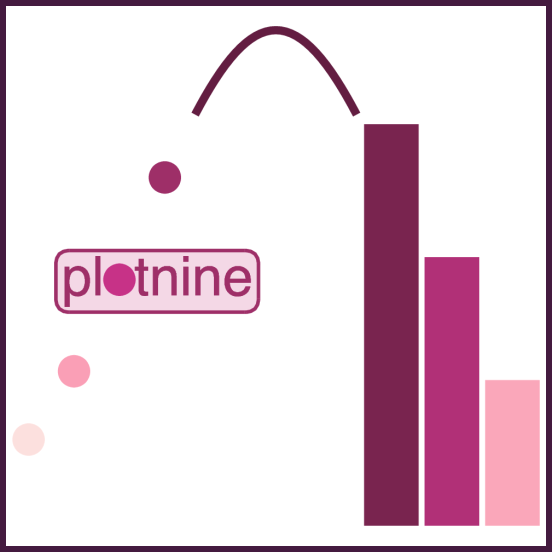

{width="300"}

# Introduction to Plotnine

Plotnine is a Python implementation of the Grammar of Graphics, inspired by R's `ggplot2`. It allows you to create complex and beautiful plots by adding layers of data, aesthetics, and geoms. This document provides a guide to creating various plots with Plotnine.

```{python}
import plotnine
print(plotnine.__version__)
```

```{python}
from plotnine import *
import seaborn as sns
import pandas as pd

# Load an example dataset
tips = sns.load_dataset("tips")
tips.head()
```

# Scatter Plot

A scatter plot is used to visualize the relationship between two continuous variables.

```{python}
p = (
    ggplot(data=tips) + aes(x="tip", y="total_bill") + geom_point()
)
p
```

## Color by Group

You can color the points based on a categorical variable to see how the relationship varies across different groups.

```{python}
p = (
    ggplot(data=tips) + aes(x="tip", y="total_bill") + geom_point(aes(color="sex"))
)
p
```

## Size by Group

The size of the points can be mapped to a variable to add another dimension to the plot.

```{python}
p = (
    ggplot(data=tips) + aes(x="tip", y="total_bill", size="size") + geom_point()
)
p
```

# Line Plot

A line plot is suitable for showing the trend of a variable over time.

```{python}
dowjones = sns.load_dataset("dowjones")
dowjones.head()
```

```{python}
p = (
    ggplot(data=dowjones) + aes(x="Date", y="Price") + geom_line()
)
p
```

## Line Plot with Dots
You can also add markers to the line plot to highlight the data points.
```{python}
p = (
    ggplot(data=dowjones) + aes(x="Date", y="Price") + geom_line() + geom_point()
)
p
```

```{python}
#| code-fold: true
import random

# Create datasets for comparison
dowjones2 = dowjones.copy()
dowjones2['type'] = 'old'

dowjones3 = dowjones.copy()
dowjones3['Price'] = dowjones3['Price'] + random.random() * 200
dowjones3['type'] = 'new'

dowjones4 = pd.concat([dowjones2, dowjones3], ignore_index=True)
dowjones4 = dowjones4.sort_values('Date').reset_index(drop=True)
```

```{python}
dowjones4.head()
```

## Color by Group

You can plot multiple lines on the same plot to compare different groups.

```{python}
p = (
    ggplot(data=dowjones4) + aes(x="Date", y="Price") + geom_line(aes(color="type"))
)
p
```

# Histogram

A histogram visualizes the distribution of a single continuous variable.

```{python}
p = (
    ggplot(data=tips) + aes(x="tip") + geom_histogram()
)
p
```

## Color by Group

You can create separate histograms for different groups to compare their distributions.

```{python}
p = (
    ggplot(data=tips) + aes(x="tip", fill='sex') + geom_histogram(position='dodge')
)
p
```

# Bar Chart

A bar chart is used to display categorical data with bars of lengths proportional to the values they represent.

```{python}
p = (
    ggplot(data=tips) + aes(x='sex', y='tip', fill="sex") + geom_col()
)
p
```

# Box Plot

A box plot shows the distribution of a dataset, including the median, quartiles, and potential outliers.

```{python}
p = (
    ggplot(data=tips) + aes(x='day', y='tip', fill="day") + geom_boxplot()
)
p
```

## Color by Group

You can group box plots by a categorical variable to compare distributions.

```{python}
p = (
    ggplot(data=tips) + aes(x='day', y='tip', fill="sex") + geom_boxplot()
)
p
```

# Strip Plot

A strip plot is a scatter plot for a categorical variable, showing the distribution of data points.

```{python}
p = (
    ggplot(data=tips) + aes(x='day', y='tip') + geom_jitter(width=0.1)
)
p
```

## Color by Group

You can color the points in a strip plot to distinguish between different groups.

```{python}
p = (
    ggplot(data=tips) + aes(x='day', y='tip', fill="sex") + geom_jitter(position=position_jitterdodge())
)
p
```

# Facet Plot

Facet plots create subplots for different subsets of the data, allowing for easy comparison.

```{python}
p = (
    ggplot(data=tips) + aes(x="tip", y="total_bill") + geom_point(aes(color="sex"))
    + facet_wrap("day")
)
p
```

## Three Plots per Row

You can control the layout of the facet grid by specifying the number of columns.

```{python}
p = (
    ggplot(data=tips) + aes(x="tip", y="total_bill") + geom_point(aes(color="sex"))
    + facet_wrap("day", ncol=3)
)
p
```

# Customizing Title, Size, and Axis Names

## Add Title

You can add a title to your plot to provide context.

```{python}
p = (
    ggplot(data=tips) + aes(x="tip", fill='sex') + geom_histogram(position='dodge') + ggtitle("Tip by Sex")
)
p
```

## Adjust Size

The size of the plot can be customized to fit your needs.

```{python}
p = (
    ggplot(data=tips) + aes(x="tip", fill='sex') + geom_histogram(position='dodge') + ggtitle("Tip by Sex") + theme(figure_size=(4, 3))
)
p
```

## Change Axis Names

You can change the labels of the x and y axes for clarity.

```{python}
p = (
    ggplot(data=tips) + aes(x="tip", y="total_bill") + geom_point() + scale_x_continuous(name="New X Name") + scale_y_continuous(name="New Y Name")
)
p
```

# Applying Themes

Plotnine offers several built-in themes to change the appearance of your plots. You can find all themes [here](https://github.com/has2k1/plotnine/tree/main/plotnine/themes).

::: {.panel-tabset .nav-pills}

## xkcd Theme

This theme gives your plots a hand-drawn, xkcd-style look.

```{python}
p = (
    ggplot(data=tips) + aes(x="tip", fill='sex') + geom_histogram(position='dodge') + theme_xkcd()
)
p
```

## theme_538

This theme mimics the style of the FiveThirtyEight website.

```{python}
p = (
    ggplot(data=tips) + aes(x="tip", fill='sex') + geom_histogram(position='dodge') + theme_538()
)
p
```

## theme_dark

This theme uses a dark background for a modern look.

```{python}
p = (
    ggplot(data=tips) + aes(x="tip", fill='sex') + geom_histogram(position='dodge') + theme_dark()
)
p
```

:::

# Saving a Plot

You can save your plot to a file in various formats.

```{python}
p = (
    ggplot(data=tips) + aes(x="tip", fill='sex') + geom_histogram(position='dodge') + theme_dark()
)
p.save(filename='test3.png')
```

# Animated Plot

Plotnine can also be used to create animated plots.

```{python}
from plotnine.animation import PlotnineAnimation
```

```{python}
#| output: false
new_data = dowjones4.sample(50, random_state=42)
new_data = new_data.sort_values(by=['Date'], ascending=True)

def plot(x):
    df2 = dowjones4.query('Date <= @x')
    p = (
        ggplot(df2, aes(x='Date', y='Price'))
        + geom_line(aes(color="type"))
        + theme(subplots_adjust={'right': 0.85})
    )
    return p

plots = (plot(i) for i in new_data["Date"])
```

```{python}
from matplotlib import rc

rc("animation", html="html5")

animation = PlotnineAnimation(plots, interval=300, repeat_delay=500)
animation
```

# Reference

- [Plotnine Official Documentation](https://plotnine.org/)
